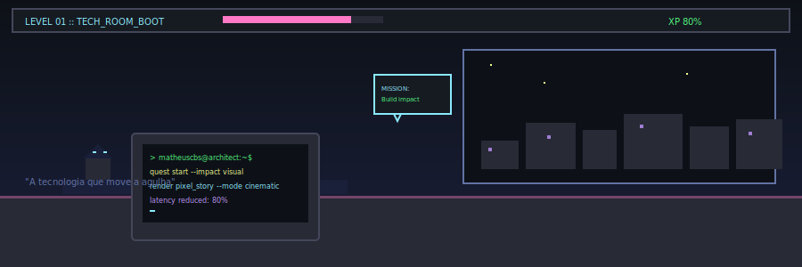
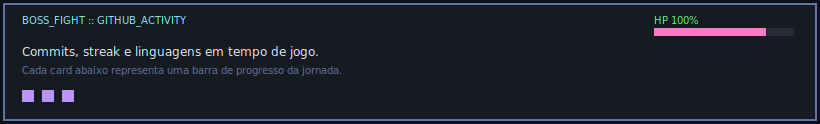
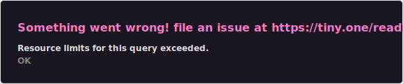

  

  
  

  <em>"A tecnologia que move a agulha."</em>

  Arquiteto de Soluções e Engenheiro de Dados apaixonado por construir sistemas escaláveis, resilientes e de alto impacto. 
  Com foco em <strong>IA Generativa</strong>, <strong>Arquiteturas Distribuídas</strong> e automação em nuvem (<strong>AWS/GCP</strong>), minha missão é transformar desafios complexos em soluções tecnológicas que geram resultados mensuráveis, como a reestruturação de plataformas que resultou em uma <strong>redução de 80% nos tempos de resposta</strong>.

---

### Sobre mim

- Pós-graduado em **Arquitetura de Software, Ciência de Dados e Cibersegurança**.
- Atualmente **Engenheiro Full Stack** na **CreditHub**, desenvolvendo projetos de IA e extração de dados em tempo real.
- Especialista em otimizar performance, garantir escalabilidade com **Kubernetes** e **Docker**, e automatizar pipelines de **ETL e DevOps**.
- Ampla experiência em **Cloud Infrastructure** (AWS/GCP) e design de sistemas **Serverless**.
- Desenvolvendo soluções de **IA Generativa** para análise de crédito e outros workflows de dados intensivos.

---

### Stack

  <a href="https://skillicons.dev">
    
     
    
     
    
  </a>

---

### Estatísticas

  

  
  

  

  

---

### Trophies

  

---

### Cobrinha de contribuições

  <picture>
    <source media="(prefers-color-scheme: dark)" srcset="https://raw.githubusercontent.com/matheuscbs/README/main/dist/github-contribution-grid-snake-dark.svg">
    <source media="(prefers-color-scheme: light)" srcset="https://raw.githubusercontent.com/matheuscbs/README/main/dist/github-contribution-grid-snake.svg">
    
  </picture>

