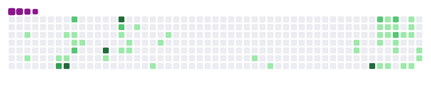

# README# 👋 Bem-vindo ao meu perfil do GitHub!

Olá! Eu sou Matheus Cardoso, um FullStack Engineer apaixonado por tecnologia especializado em arquitetura de software, cibersegurança e ciência de dados e Graduado em Engenharia Elétrica pelo IFMG. 💻

## 🚀 Sobre mim

Atualmente, sou um desenvolvedor full-stack com conhecimentos em diversas tecnologias, como:

- HTML/CSS
- JavaScript
- TypeScript
- Python
- Flask
- Django
- Node.jS
- NestJS
- ReactJS
- NextJS
- Jest
- CI/CD
- PostgreSQL
- MongoDB
- AWS
- GCP
- Kubernetes

Adoro trabalhar em projetos desafiadores e aprender coisas novas a cada dia. 💪

## 📫 Entre em contato

Se você tiver alguma pergunta ou sugestão, não hesite em entrar em contato comigo por e-mail ou através do meu perfil no LinkedIn. Vou adorar ouvir de você! 📧

## 🎉 Obrigado pela visita!

Obrigado por conferir meu perfil do GitHub. Espero que você tenha gostado! Fique à vontade para seguir-me e verificar meus projetos. 👍
